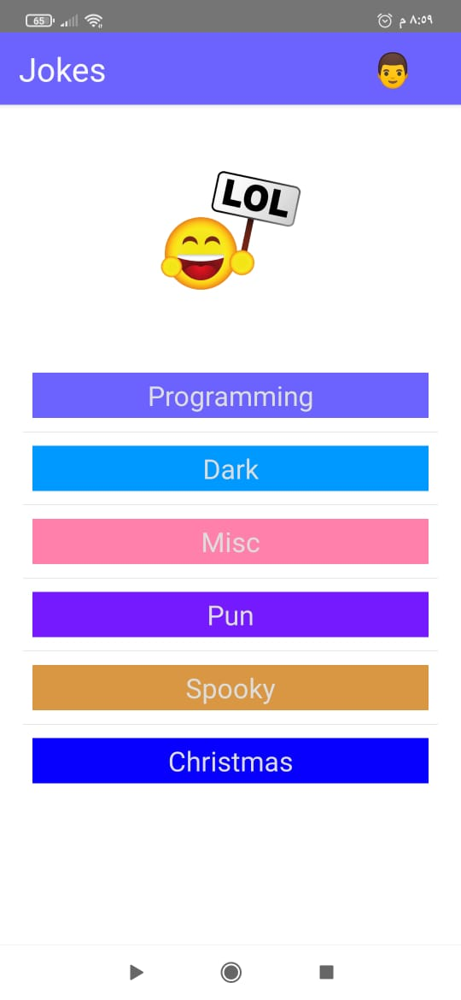
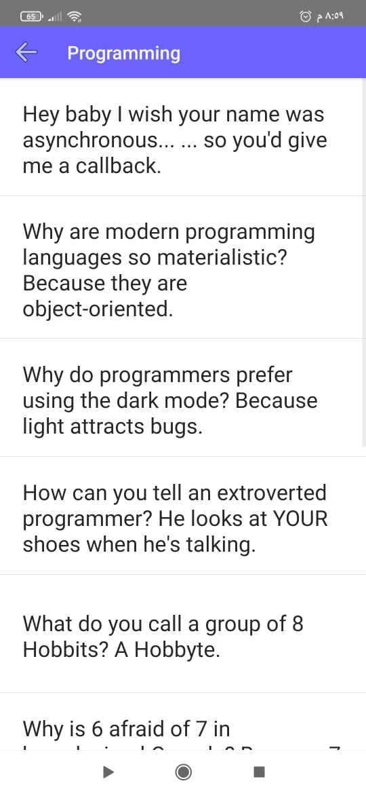

# jokes






> A native application built with NativeScript-Vue

## Usage

``` bash
# Install dependencies
npm install

# Preview on device
tns preview

# Build, watch for changes and run the application
tns run

# Build, watch for changes and debug the application
tns debug <platform>

# Build for production
tns build <platform> --env.production

```
